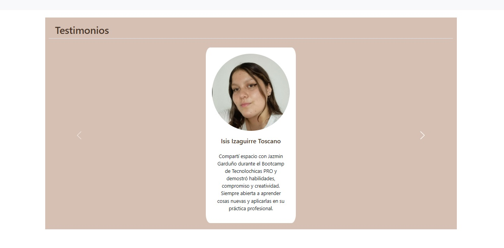

## Portafolio de proyectos

¡Hola! Soy ***Jazmin Garduño Martinez***, soy desarrolladora web Jr. Apacionada por la tecnología, aquí encontrarás información sobre mí.

______
### El proyecto cuenta con las secciones de:

- 💪 Habilidades 
- 📋 Proyectos
- 🙎‍♂️ Testimonios
- 📫 Contacto

### Creado con:
- HTML
- CSS
- JavaScript

  
### Vista Previa

### *Contactame*
*Correo*
[gardunoyazmin26@gmail.com](mailto:gardunoyazmin26@gmail.com)

________

### Creado en el bootcamp de TecnolochicasPro 

